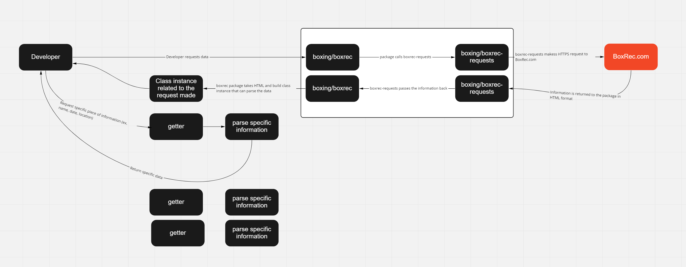

# Contributing

## Welcome
If there is an [open issue](https://github.com/boxing/boxrec/issues) feel free to comment that you'll work on it.  This prevents multiple people from working on the same issue.

## Documentation
[Documentation on the interfaces/classes can be found here](https://boxrec-npm-docs.s3.us-east-2.amazonaws.com/master/index.html)

## Development Setup
-   Requires Node 8+
-   Fork the project to create a copy of it under your GitHub user
-   `git clone` that project
-   Run `yarn install` or `npm install` within the parent directory
-   Write code and E2E tests to ensure proper functionality is expected
-   For additional commands, look under the scripts section inside `package.json`
-   For testing, run `yarn test-e2e`

## Setup Issues
-   If you run into any issues while getting set up with development of this project, create an issue.  Working out the small details and hiccups will help others get started in the future

## Development Notes
-   If your project needs changes to the HTTPS requests to BoxRec, you'll need to work on this [repo](https://github.com/boxing/boxrec-requests)
-   Ensure if you are working on separate repos to test the changes with `npm link`.  This assumes you understand what the purpose of `npm link` is

## Code Style
-   Follow the same coding style (Use an IDE that supports ES/TSLint/EditorConfig).  The project code style should look like one person has written the code for consistency reasons
-   Keep pull requests to one feature/fix
-   If you're unsure of anything, [ask one of these people](https://github.com/orgs/boxing/people)

## Issues and Bugs
If you have found a problem, follow these steps:

-   Create an issue [here](https://github.com/boxing/boxrec/issues)
-   Give a good example on how to reproduce this issue.  Ex. When I search for `Mike Tyson` using these parameters `{ first_name: "Mike", last_name: "Tyson" }`, it says he has X wins but he actually has Y wins.
-   Label it accordingly: "bug" if it's an issue with this code.  
-   [Sometimes the UI for BoxRec changes and breaks the code as well, there is a specific label for that](https://github.com/boxing/boxrec/issues?q=is%3Aissue+is%3Aclosed+label%3A%22BoxRec+UI+changed%22).  This allows tracking of changes to the BoxRec UI.

## Security Vulnerabilities
If you have a found a security vulnerability with this package or a security vulnerability please create an [issue](https://github.com/boxing/boxrec/issues).  Emails will be sent out notifying [people in this org](https://github.com/orgs/boxing/people) 

## Suggestions
If you have a suggestion, feel free to create an issue with the label "suggestion".  Please note that this project is more of a BoxRec API and nothing more.

## Pull Requests
When your change is ready, create a pull request from your repo to this repo.  The pull request should be pointing to `develop`.  Assign one of the following people from [here](https://github.com/orgs/boxing/people).  Pull Requests are required to successfully build before they can be merged in.  We merge into `develop` and not straight to `master` as not all changes are releasable at the time.  Current Git style is like `git flow` but without squashing of commits to master.

## Requirement to have pull requests accepted
-   Must include unit tests for the new functionality/fix.  Write tests that prove the functionality works, not to merely pass code coverage
-   Must pass code review
-   Must follow the same coding style

## Development Walkthrough

### Before anything

This project heavily uses Typescript and decorators to work.  The reason for the heavy use of decorators was for maintainability, to speed up changes and because there is overlap between pages.

If you do not understand Typescript and decorators, some of the code will look strange to you.

## How it works

This project works by making HTTP requests through [boxing-requests](https://github.com/boxing/boxrec-requests).  The reason
it is separated was that potentially the HTTPS requests portion could be used by other projects.



This package takes an HTML document and parses the information using [Cheerio](https://cheerio.js.org/), which like jQuery can parse HTML.

The hardest parts are maintainability, as we can't control when BoxRec changes things or breaks things.  So this package always can potentially break.
BoxRec.com has poor HTML standards and strange choices, which also can make things difficult.  Tables inside tables, multiple `thead` elements per table, inconsistencies with CSS selectors to name a few things.

After a request is made, this package will feed the HTML into a class.  The classes differ depending on the request made.

Example:

when requesting a boxer profile

```typescript
const boxer = await boxrec.getPersonById(352);
```

The HTML is fed into [BoxrecPageProfileBoxer](https://github.com/boxing/boxrec/blob/master/src/boxrec-pages/profile/boxrec.page.profile.boxer.ts)

`BoxrecPageProfileBoxer` has a number of getters that when used, will take the HTML and parse that specific information that was requested.
If you notice at the top there are a number of decorators, those update the class to add additional getters.

### Important pieces of code

#### Helpers

There is an important helper function that was created to parse table data.  When developing this package, BoxRec would sometimes add new columns, change
the order of columns, or remove columns.  This made ensuring the correct data returned difficult.

This function [getHeaderColumnText](https://github.com/boxing/boxrec/blob/cc585d67159942491229341a157e3e46fc20497c/src/helpers.ts#L138)
takes a table element, attempts to get what column it is by the header text, if it exists.  If it does not exist, it then
goes through the first row of data and attempts to figure out the column by what data is in there.
